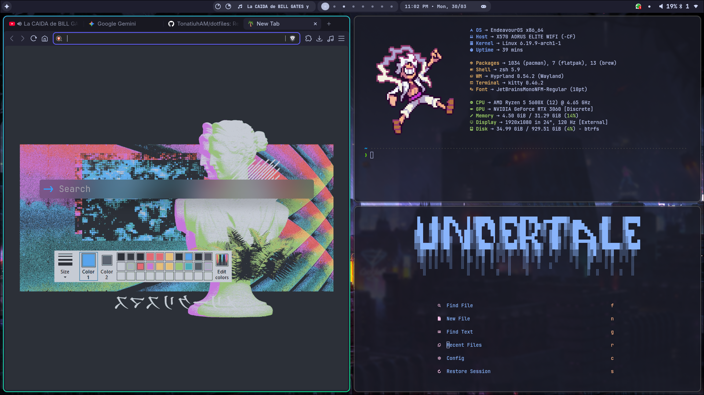
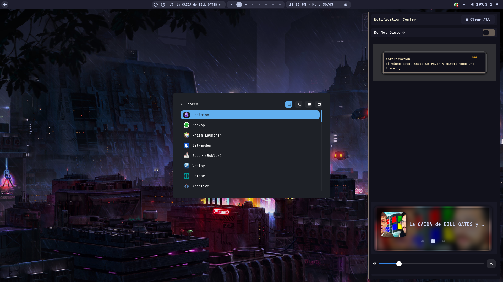

# 🐧 Tona's Dotfiles

  
  
  
  

 

Este repositorio contiene mis archivos de configuración personal para mi flujo de trabajo diario. Recientemente migré de una **MacBook M2** a un entorno basado en **Arch Linux**, buscando minimalismo y control total sobre el sistema a través de herramientas CLI/TUI.

---

## 📸 Screenshots

---

## 💻 Entornos Soportados

Actualmente mantengo configuraciones para dos mundos:

* **Main Rig (Arch Linux - EndeavourOS):** Mi setup principal enfocado en productividad y desarrollo con **Hyprland**.
* **Legacy/Laptop (macOS):** Configuraciones optimizadas para mi MacBook M2, aprovechando la potencia del silicio de Apple pero manteniendo la consistencia de la terminal.
* **Home Server (Ubuntu Server):** Configuración mínima para mi servidor donde corro Docker, Proxmox y mis servicios de automatización.

---

## 🛠️ Componentes Clave

| Categoría | Herramienta | Descripción |
| :--- | :--- | :--- |
| **Window Manager** | [Hyprland](https://hyprland.org/) | Tiling compositor dinámico basado en Wayland. |
| **Terminal** | Kitty | Emuladores rápidos y con soporte para ligaduras. |
| **Shell** | ZSH + Oh My Zsh | Con plugins como `syntax-highlighting` y `autosuggestions`. |
| **Editor** | Neovim | Mi IDE personalizado con Lua (inspirado en NVChad/LazyVim). |
| **Multiplexer** | Zellij | Para gestionar sesiones persistentes en local y servidor. |
| **File Manager** | Yazi | Navegación de archivos rápida desde la terminal. |
| **Git UI** | Lazygit | La mejor forma de manejar git sin salir de la CLI. |

---

> [!WARNING]  
> Mis dotfiles están personalizados para mi flujo de trabajo. Revisa los archivos antes de ejecutarlos para evitar conflictos con tu hardware.

---

  Configurado con ☕ por <b>Tonatiuh</b>
   
  <a href="https://tonatiuham.dev">tonatiuham.dev</a>

