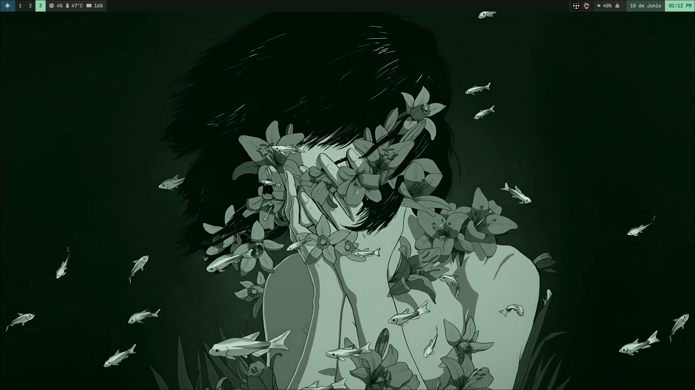
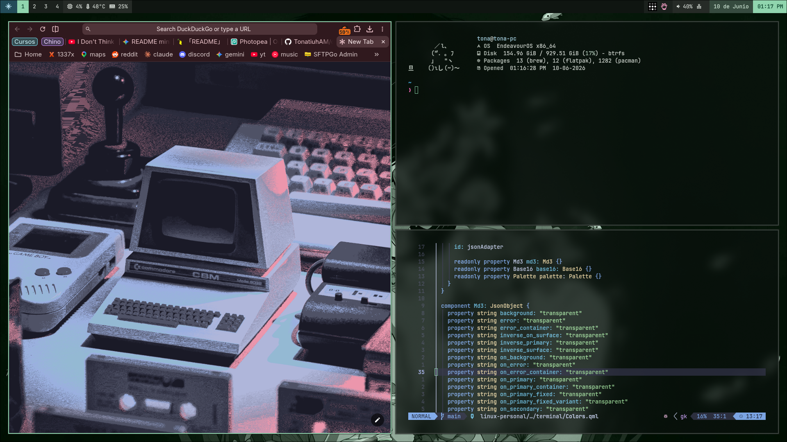
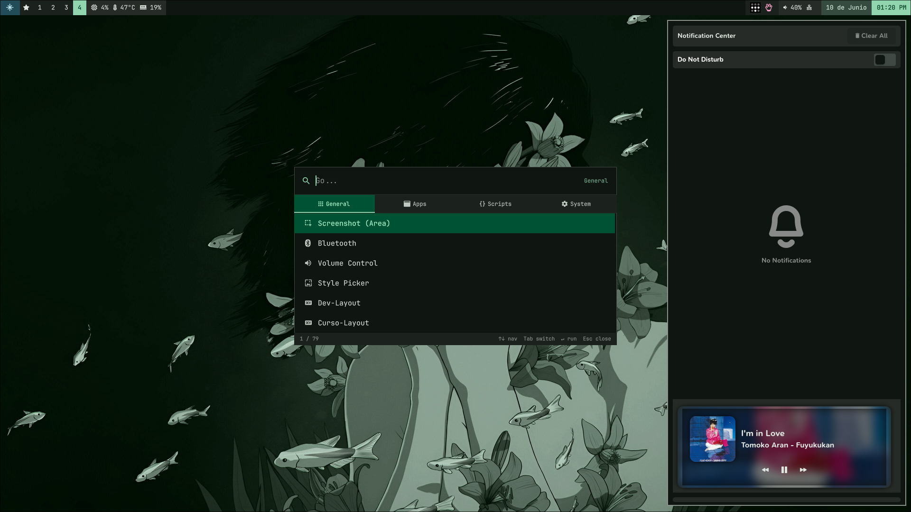
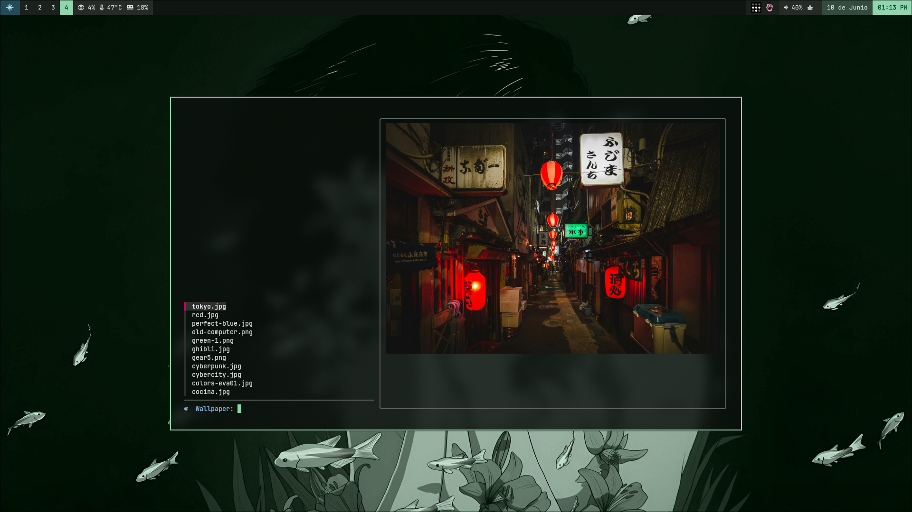

# 🐧 Tona's Dotfiles 

<div align="center">
  
  
  
  
</div>


# ✳️ Overview

```text
~/dotfiles -----------------------------------------------------------------------------------
» tona --version

tona-dotfiles v2.4.0 (Keyboard-driven, minimalist ecosystem)
"La simplicidad es la máxima sofisticación."
```

```text

~/dotfiles -----------------------------------------------------------------------------------
» fastfetch --source ascii.txt

⚡ CORE SYSTEMS
├── OS       :: EndeavourOS (Arch Linux)
├── WM       :: Hyprland (Wayland Tiling Compositor)
└── Shell    :: ZSH (Zoxide + FZF + Autosuggestions)

🪐 UI & NOTIFICATIONS
├── Quickshell :: Flexible, QML-based desktop shell component toolkit
├── SwayNC     :: Lightweight, Wayland-native notification daemon
└── Matugen    :: Material You color generation CLI utility

💻 APPLICATIONS
├── Terminal :: Kitty (Fast, GPU-accelerated)
├── Editor   :: Neovim (Custom Lua configuration, Lazy-powered)
├── Multiplex:: tmux (Session management)
├── File Mngr:: Yazi (Blazing fast terminal file manager)
└── Git UI   :: Lazygit (Keyboard-driven git workflow)
```


## 📸 Screenshots


| Desktop | Tiling Manager |
| --- | --- |
|   |   |
| **App Launcher & Notifications** | **Style Picker** |
|   |   |


# ⌨️ Usability


```text
~/dotfiles -----------------------------------------------------------------------------------

» stow ./linux-personal
- [!] CRITICAL WARNING / LEER ANTES DE EJECUTAR
- Estos archivos están estrictamente personalizados para mi hardware y flujo de trabajo.
- No ejecutes scripts a ciegas; revisa, comprende y adopta bajo tu propio riesgo.
```

# 🎓 More of Me

```md
~/dotfiles -----------------------------------------------------------------------------------
» curl -s https://tonatiuham.dev

🧑‍💻 Tonatiuh
├── Role   :: DevOps & Linux SysAdmin Enthusiast
├── Stack  :: Python • Linux • TUI Workflow
└── Domain :: https://tonatiuham.dev
```

<div align="center">
  <span style="font-size: 1.1em;"><b><a href="https://tonatiuham.dev">tonatiuham.dev</a></b></span>
</div>
